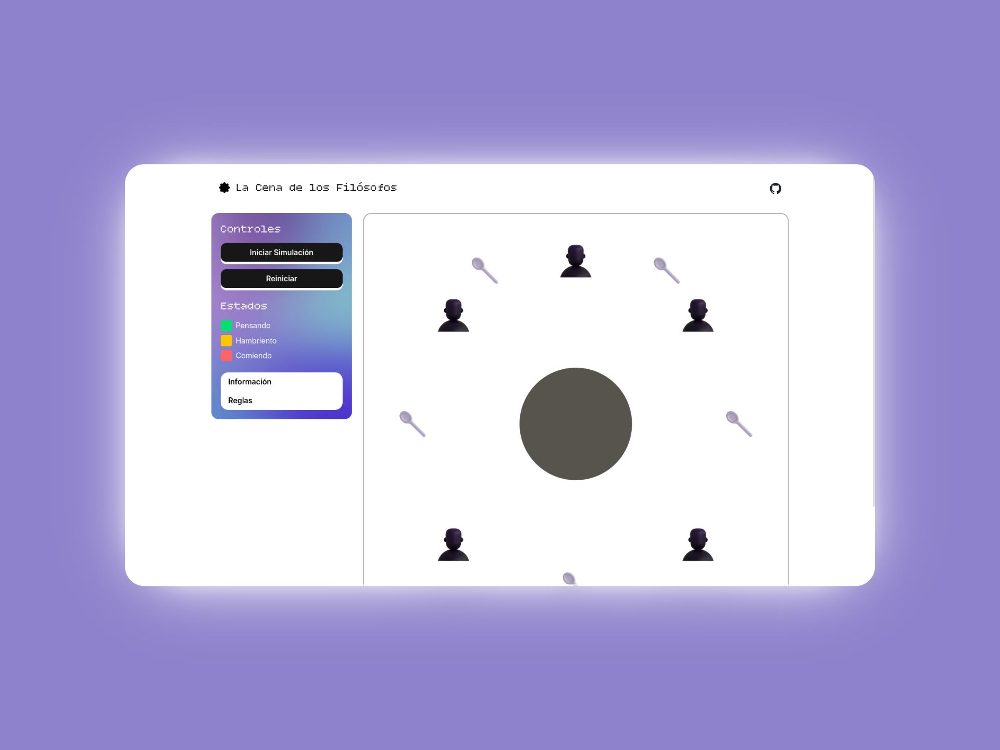

# La Cena de los Filósofos

Este proyecto es una simulación del problema de la Cena de los Filósofos, un problema clásico de sincronización en ciencias de la computación. Esta aplicación visualiza el problema con cinco filósofos sentados alrededor de una mesa circular.

## Descripción

El problema de la cena de los filósofos es un ejemplo utilizado para ilustrar los problemas de sincronización en sistemas operativos y programación concurrente. Cinco filósofos se sientan en una mesa redonda con un plato de espaguetis frente a cada uno. Hay un tenedor entre cada par de filósofos. Un filósofo necesita dos tenedores para comer. El desafío es diseñar un protocolo que permita a los filósofos comer sin que se produzcan interbloqueos (deadlocks) o inanición (starvation).

Esta simulación visualiza los tres estados de un filósofo:

-   **Pensando:** El filósofo está pensando y no necesita tenedores.
-   **Hambriento:** El filósofo quiere comer y necesita dos tenedores.
-   **Comiendo:** El filósofo tiene dos tenedores y está comiendo.

## Instalación

Para ejecutar este proyecto localmente, sigue estos pasos:

1.  **Clona el repositorio:**

    ```bash
    git clone https://github.com/juliannGabrielDev/cena-filosofos.git
    cd cena-filosofos
    ```

2.  **Instala las dependencias (usando Bun):**

    ```bash
    bun install
    ```

3.  **Inicia el servidor de desarrollo:**

    ```bash
    bun run dev
    ```

    La aplicación estará disponible en `https://julianngabrieldev.github.io/cena-filosofos/`.

Nota: este README usa `bun` como gestor de paquetes y para ejecutar scripts. Si prefieres, muchos comandos de `npm` también funcionan con `bun` (por ejemplo `bun install` en lugar de `npm install`). Asegúrate de tener Bun instalado: https://bun.sh/

## Uso

-   **Iniciar Simulación:** Haz clic en este botón para comenzar la simulación. Los filósofos comenzarán a pensar, tener hambre y comer.
-   **Detener Simulación:** Haz clic en este botón para pausar la simulación.
-   **Reiniciar:** Haz clic en este botón para restablecer la simulación a su estado inicial.

## Tecnologías Utilizadas

-   **React:** Una biblioteca de JavaScript para construir interfaces de usuario.
-   **Vite:** Una herramienta de construcción de frontend moderna y rápida.
-   **TypeScript:** Un superconjunto de JavaScript que añade tipado estático.
-   **GSAP (GreenSock Animation Platform):** Una biblioteca de animación de JavaScript para crear animaciones de alto rendimiento.
-   **Tailwind CSS:** Un framework de CSS de utilidad primero para un diseño rápido de interfaces de usuario.

## Capturas de pantalla

A continuación hay una captura de la interfaz de usuario de la simulación.

